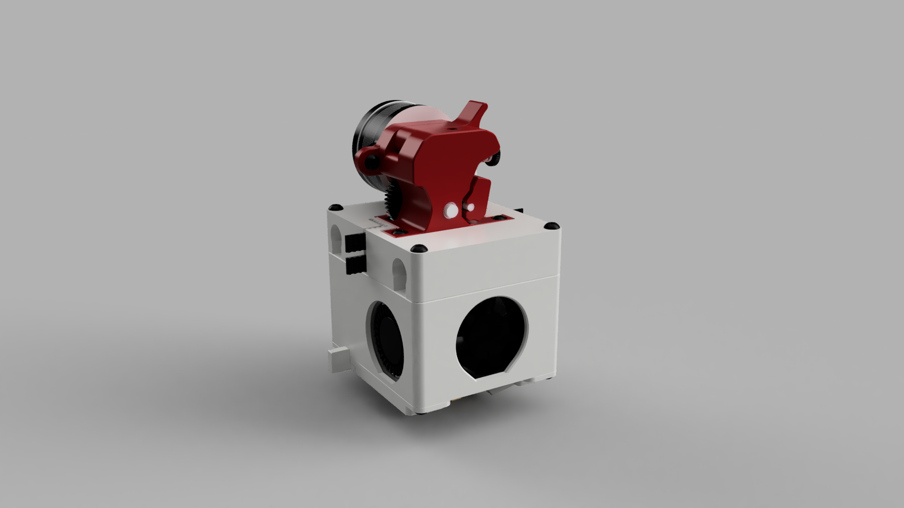
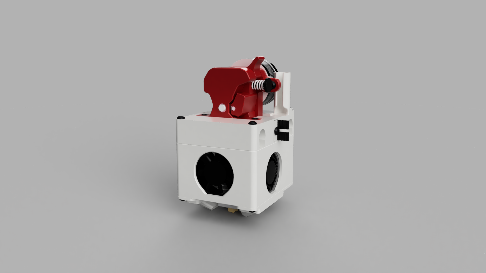
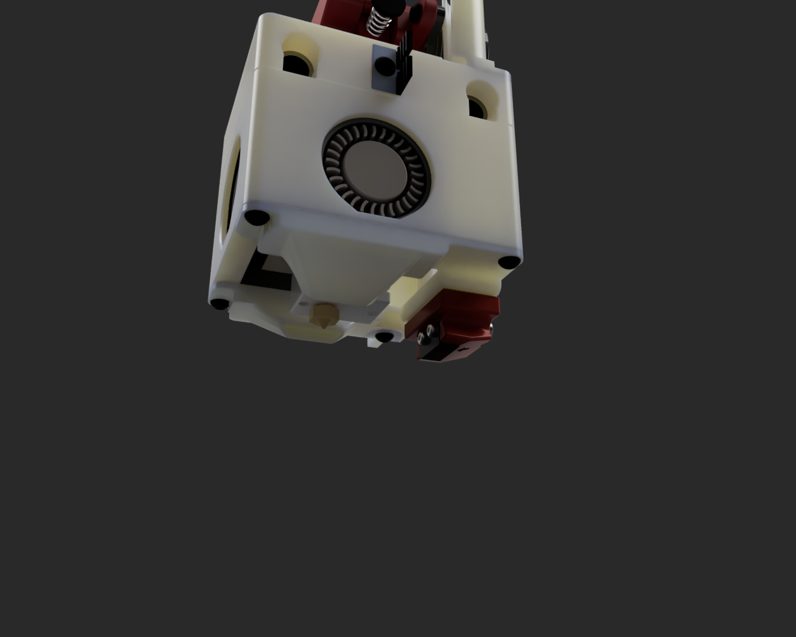
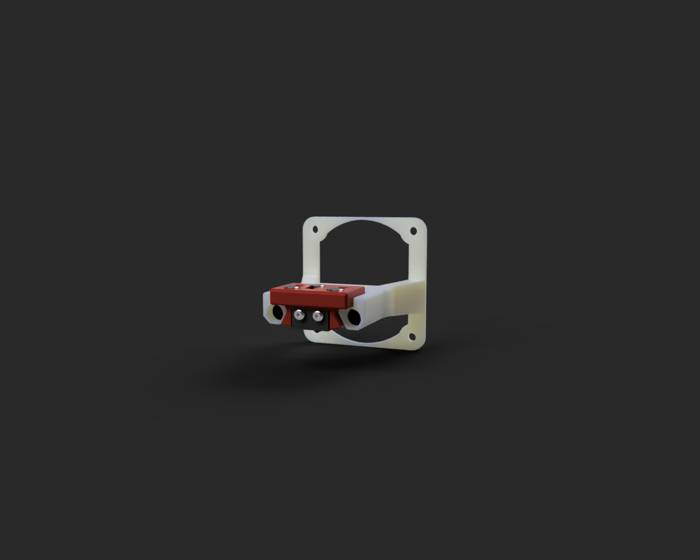

## FBG6-Condor

Проект печатной головы для принтера FBG6 с поддержкой Klicky и фидером с быстрым отжимом прижима филамента для более легкой замены прутка.

Используемые детали:
- Стоковый радиатор FBG6
- Гладкое горло 21мм
- Турбинки 4010 GDSTime
- Вентилятор 3010 GDSTime
- Набор BMG шестерней для экструдера
- Круглый шаговый двигатель Nema 14 
- Круглые магниты 5х5мм 8шт для Klicky

## [Настройка Klicky Probe](https://github.com/Chiffa-C3/FBG6-Condor/tree/main/Klicky)

Более подробно о Klicky Probe можно узнать на [странице проекта](https://github.com/jlas1/Klicky-Probe/tree/main)

Док станция для Klicky крепится поверх вентилятора на задней стенке принтера

