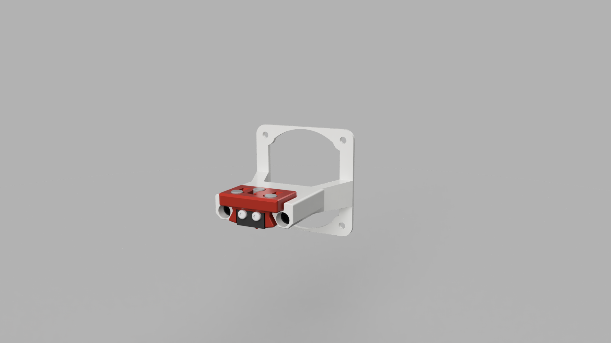

# FlyingBear Ghost 6 Проект печатной головы "Кондор" 

Проект печатной головы для принтера FBG6 с поддержкой [Klicky-Probe](https://github.com/jlas1/Klicky-Probe) и фидером на основе Mini Stealthburner с быстрым отжимом филамента для более легкой замены прутка.

Используемые детали:
- Стоковый радиатор FBG6
- Гладкое биметалическое горло 21мм
- Турбинки 4010 GDSTime
- Вентилятор 3010 GDSTime
- Набор BMG шестерней для экструдера
- Шаговый двигатель Nema 14 [36STH20](https://aliexpress.ru/item/1005002717890067.html?sku_id=12000031330274970)
- Круглые магниты 5х5мм 8шт для Klicky
- Концевик (микрик)

## [Настройка Klicky Probe](https://github.com/Chiffa-C3/FBG6-Condor/tree/main/Klicky)

Более подробно о Klicky Probe можно узнать на [странице проекта](https://github.com/jlas1/Klicky-Probe/tree/main)

Док станция для Klicky крепится поверх вентилятора на задней стенке принтера

